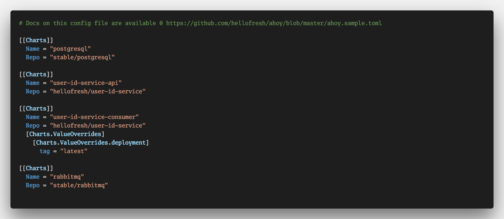

## **Ahoy! Training**


^ Ahoy! is a simple tool that orchestrates all the complexity to create a new environments (namespace) with all necessary services

---

## What is _**Ahoy!**_

^ Ahoy! solves the problems of team stagings @ HelloFresh

---

## Kubectl + Helm

^ Under the hood Ahoy! orchestrates how Kubectl and Helm work together
^ It also orchestrates how some basic services like (Entry, Janus and Consul2Kube) work

---

## What _**Ahoy!**_ is not?

^ Ahoy! is not a tool to solve devenv or any deployment to staging or live enviroments
^ Ahoy! was not created to run integration tests on CI, although it can help with that
s

---
## What is an environment?


^ We had to figure it out what is an environment @ HelloFresh
^ We follow the Phoenix Enviroment concept

---

## Entry Point

^ This is a cluster of nginx reverse proxies that serves our frontend applications.

---

## API Gateway

^ This is a cluster of API Gateways (Janus) that serves our APIs

---

## Service Discovery

^ We use Kube built in service discovery, but the trick here was to integrate back with consul

---

## What is Helm?

^ Helm helps you manage Kubernetes applications — Helm Charts helps you define, install, and upgrade even the most complex Kubernetes application.

---

### Helm helps you manage Kubernetes applications

---

## Charts

^ A chart is a collection of files that describe a related set of Kubernetes resources

---


---

## Back to Ahoy!

^ Lets understand how a development flow with Ahoy! works

---

### Working on a new feature

---

### Create a new branch

---

### You now want to test that branch

---

### You open a PR

^ At this stage you should be pushing your charts on CI to chartmuseum
^ The same applies to your Docker images

---

## The config file



---

## Under the hood


---


---

## Lets practice


---

## Requirements to start

---

### A Dockerized service


---

#### Docker images are built on PR and merges to master

---

### Helm _**v2.8**_ or above installed

---

### *`hellofresh+k8s_deploy`*
#### robot account has read access on your quay.io repo

---

### Download the scaffold

```sh
git clone git@github.com:hellofresh/hf-helm-scaffold.git $(helm home)/starters/hf-helm-scaffold
```

### Run the scaffold

```sh
helm create --starter hf-helm-scaffold <your-service-name>
```
