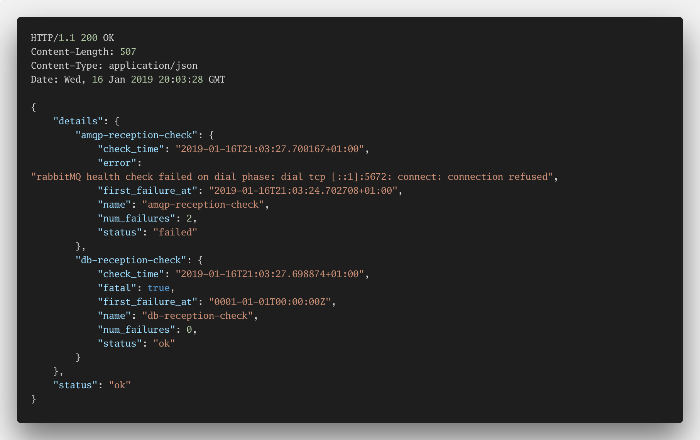
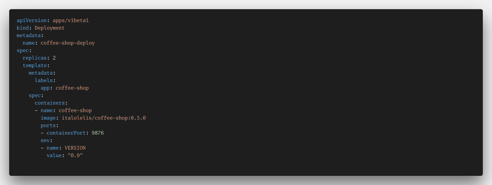

footer: Go Days Berlin 2019

## Designing for Failure
### @italolelis

---

## Who __am__ I?

---

^ Think about an airplane, a boing 777 to be especific

---

^ It has something called ELMS. It controls all eletric circuits in the plane
- If this system fails there are at least 4 fallbacks that are automatically activated to keep the essentials eletric systems running

---

## __Essentials__

^ The important word here is essentials
- The plane keeps running without problems for a limited period of time and without manual intervention
- This system was created on 1993

---

> Resilience is a Requirement, Not a Feature
-- Liang Guo

---

## Dependency Isolation and Graceful Degradation

^ In a distributed services architecture, a service will often have multiple downstream dependencies
- When the number of dependencies increase, the probability of a single problematic dependency bringing down a service becomes higher.

---

## Health-check and Load Balancing

^ Standard helath checks will help load balancers understand when something is wrong
- They will kik the missbehaving instance our of the cluster to ensure no requests goes to it

---

---

## If everything is OK you get...

---

---

## If things are not good but your app still can work...

---

---

## Otherwise...

---

---

## Self-healing

^ Now, if your instance is kiked out of the cluster you probably want that back
- Container Orchestration systems normally try to spin up a new instance of your application in the same cluster as soon as possible

---

## In *kube* this is as simple as defining a YAML file rule

---

---

## Load shedding

^ Circuit Breakers
- API Request Deadline
- Request Queuing

---

## Retry Logic

^ CB are more efficient when they have a retry logic with exponential backoff

---

## Bulkhead

---

## Rate Limiters

^ Client Quota-based Rate Limit

---

## Failover caching

---

## Event Driven Architecture

---

## Outbox Pattern

^ How can producers reliably send messages when the broker/consumer is unavailable?
- Lets imagine that you are pushing events into rabbitmq. Now think that for some reason rabbitmq is not available
- What happens to the messages?

---

## SLO's and SLI's

---

## Monitoring

---

---

## Distributed Tracing

---

---

## Open Census

---

---

## Recap

1. Always think about your dependencies
2. Dependency Isolation and Graceful Degradation
3. Load shedding and Request Controlling
4. Observalibility is not optional

---

## Questions and links!

* Example application: https://github.com/italolelis/coffee-shop
* Link to the slides: https://github.com/italolelis/talks

---

