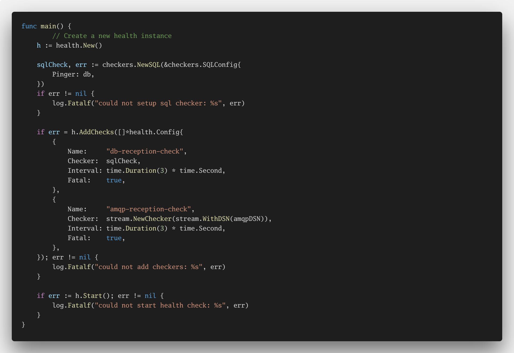
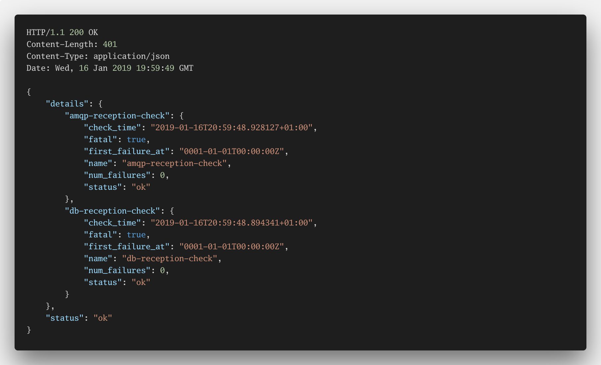
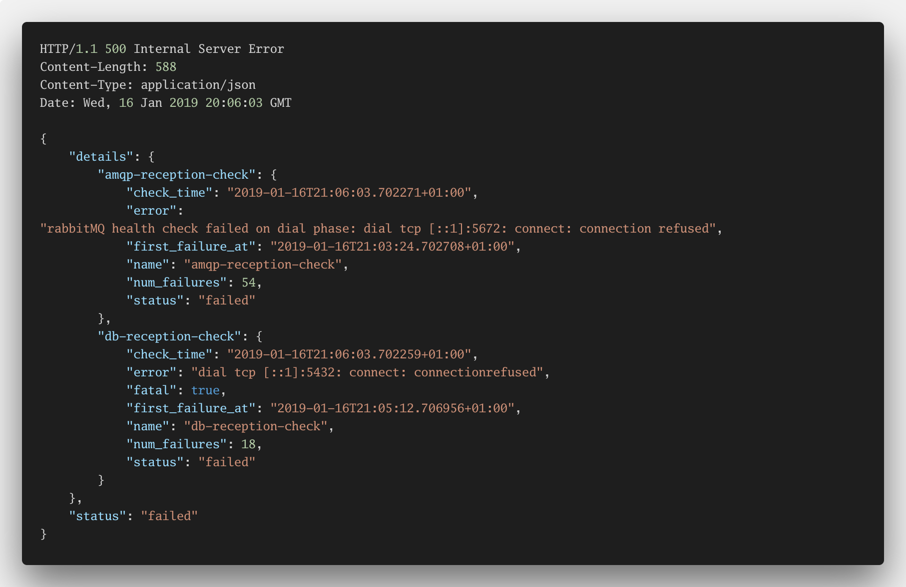
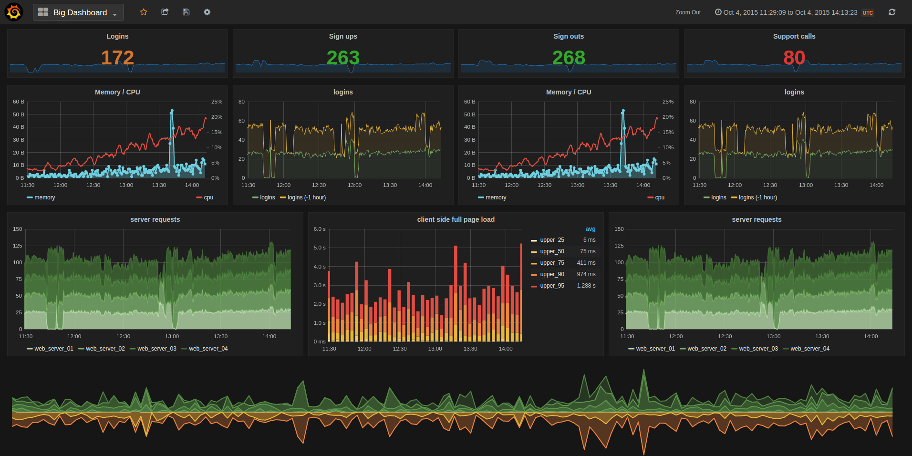

footer: Go Days Berlin 2019

## Designing for Failure
### @italolelis

---

## Desining *systems* for the *unexpected*!

---

Think about an airplane, a boing 777 to be especific

^ The first plane flight happened in 1906

---

# *__ELMS__*
## (Electrical Load Management System)

^ It has something called ELMS. It controls all eletric circuits in the plane
- If this system fails there are at least 4 fallbacks that are automatically activated to keep the essentials eletric systems running

---

## __Essentials__

^ The important word here is essentials
- The plane keeps running without problems for a limited period of time and without manual intervention
- This system was created on 1993

---

> Resilience is a Requirement, Not a Feature
-- Liang Guo

---

## Dependency Isolation and Graceful Degradation

^ In a distributed services architecture, a service will often have multiple downstream dependencies
- When the number of dependencies increase, the probability of a single problematic dependency bringing down a service becomes higher.

---

## Health-check and Load Balancing

^ Standard helath checks will help load balancers understand when something is wrong
- They will kik the missbehaving instance our of the cluster to ensure no requests goes to it

---

---

## If everything is OK you get...

---

---

## If things are not good but your app still can work...

---

---

## Otherwise...

---

---

## Self-healing

^ Now, if your instance is kicked out of the cluster you probably want that back
- Container Orchestration systems normally try to spin up a new instance of your application in the same cluster as soon as possible

---

### Container orchestrators do this automatically

---

# *Load shedding*

^ Circuit Breakers
- API Request Deadline
- Request Queuing

---

## Circuit Breakers

---

---

---

## Retry Logic

^ To create resilient microservices, you need to handle possible HTTP failure scenarios
- CB are more efficient when they have a retry logic with exponential backoff

---

## Rate Limiters

^ You may think rate limiter are only used in an edge layer. 
Think about a caller of your service. Let's say that it's missbehaving and overloading your service.
A rate limiter would help you prevent this kind of scenarios.
Client Quota-based Rate Limit

---

---

## Bulkhead

^ Isolates consumers and services from cascading failures. An issue affecting a consumer or service can be isolated within its own bulkhead, preventing the entire solution from failing.
- Allows you to preserve some functionality in the event of a service failure. Other services and features of the application will continue to work.
- Allows you to deploy services that offer a different quality of service for consuming applications. A high-priority consumer pool can be configured to use high-priority services.

---

^ The titanic set sail on 1912

---

---

## Outlier Server Host Detection

---

## Outbox Pattern

^ How can producers reliably send messages when the broker/consumer is unavailable?
- Lets imagine that you are pushing events into rabbitmq. Now think that for some reason rabbitmq is not available
- What happens to the messages?

---

## Service Mesh

---

# *Observability*

---

## Defining your SLO's and SLI's

---

## Monitoring

---

---

## Distributed Tracing

---

---

---

## Open Census

---

---

## Recap

1. Always think about your dependencies
2. Dependency Isolation and Graceful Degradation
3. Load shedding and Request Controlling
4. Observalibility is not optional

---

## Questions and links!

* Example application: https://github.com/italolelis/coffee-shop
* Link to the slides: https://github.com/italolelis/talks

---

# Thank you!

